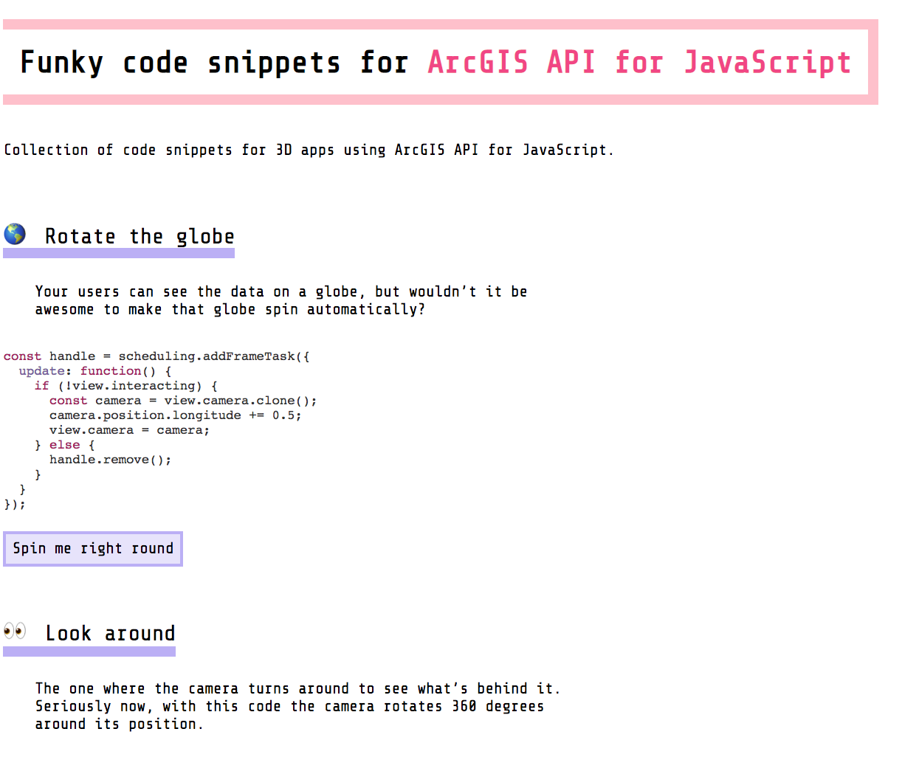

# A collection of code snippets for ArcGIS API for JavaScript

This repository contains code snippets that might come in handy when programming 3D applications with ArcGIS API for JavaScript,
like rotating the globe, getting camera position, changing the daytime in a webscene etc. View them all live at https://ralucanicola.github.io/code-snippets-arcgis-api-js/index.html:

Contribute to this repo by adding your own snippets to [snippets.md](./snippets.md) and adding an example to the [examples folder](./examples) :)

