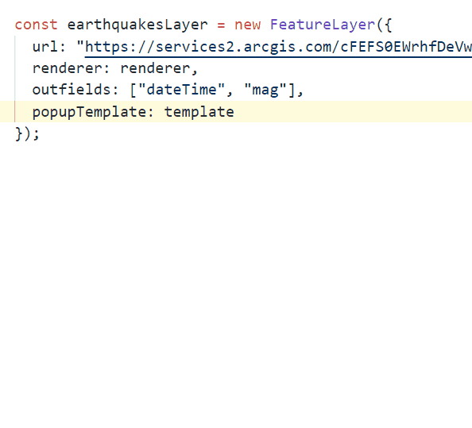
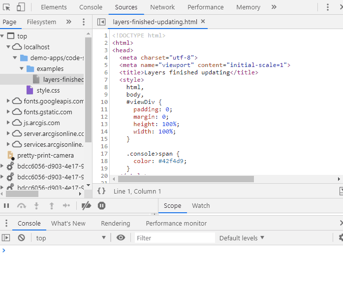
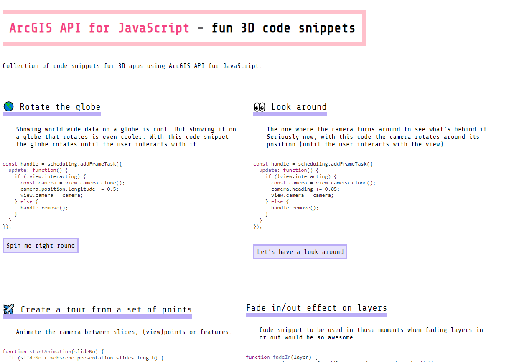

# A collection of code snippets for ArcGIS API for JavaScript

This repository contains code snippets that might come in handy when programming 3D applications with ArcGIS API for JavaScript.

## Development code snippets

These are the ones that you use often and that follow the same pattern: setting renderers, symbols, labels, visual variables etc. To avoid to always go to the documentation and copy the examples I created a [list of VSCode snippets](./dev-snippets/javascript.json).

How to use it

To install them you need to go to the code snippets in VSCode: `Preferences` > `Configure user snippets` and select `javascript.json`.
Copy paste the snippets that are useful for you from [this list](./dev-snippets/javascript.json) into the `javascript.json` file. Each snippet has a prefix that you can type in your app and once you press `Tab` the snippet will show up.

Some more hints:

- make sure to have `"editor.tabCompletion": "on"` in the settings (`Preferences` > `Open Settings(JSON)`)
- if pressing `Tab` doesn't work then you might have several snippets with the same prefix. Press `Ctrl-Space` (`Cmd-Space` on mac) to select the one you need.
- change the prefix/snippets as you like, the syntax uses [TextMate snippet syntax](https://macromates.com/textmate/manual/snippets).
- official documentation for this feature is on [VSCode website](https://code.visualstudio.com/docs/editor/userdefinedsnippets).

## Debugging code snippets

These code snippets are useful to figure out what's going on in the browser. What is my camera position? Why is the layer not showing up? Getting access to the view will grant you super powers, like access to the layers and their views etc.

You will most likely use these code snippets in the browser. Therefore it's useful to also store them in the browser. Google Chrome has a useful feature in the dev tools called `Snippets`, where you can keep all of these snippets handy.

Here's how it works

## Fun code snippets

These are the code snippets that you use to spice up your app. You might only need them once every 10 apps or so, but they provide some nice effects. For example rotating the globe, fading layers in or out, animating between several points etc. View them all live [here](https://ralucanicola.github.io/code-snippets-arcgis-api-js/fun-snippets/index.html).

Feel free to make a PR to contribute with your own snippets or suggest
new code snippets with an issue :)

